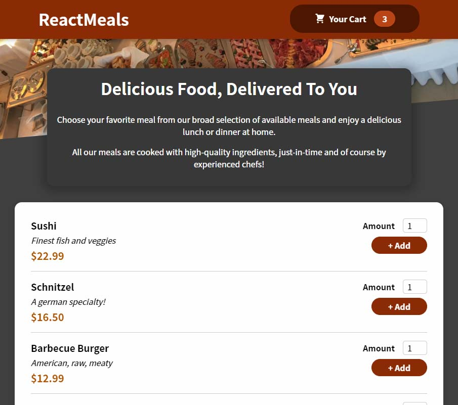

# Food App: React.js food ordering demo app

React - Food App is a React.Js application that simulates online food ordering. It is still in development.

The app is deployed and available to use on the link below:

https://saron-react-food-app.netlify.app/
## Tech Stack

**Client:** React.js

## Features

- The user can select the meal and add it to the cart.
- The user can change the number os items from ousite and inside the cart.
- The user can checkout the order.

## Screenshots

